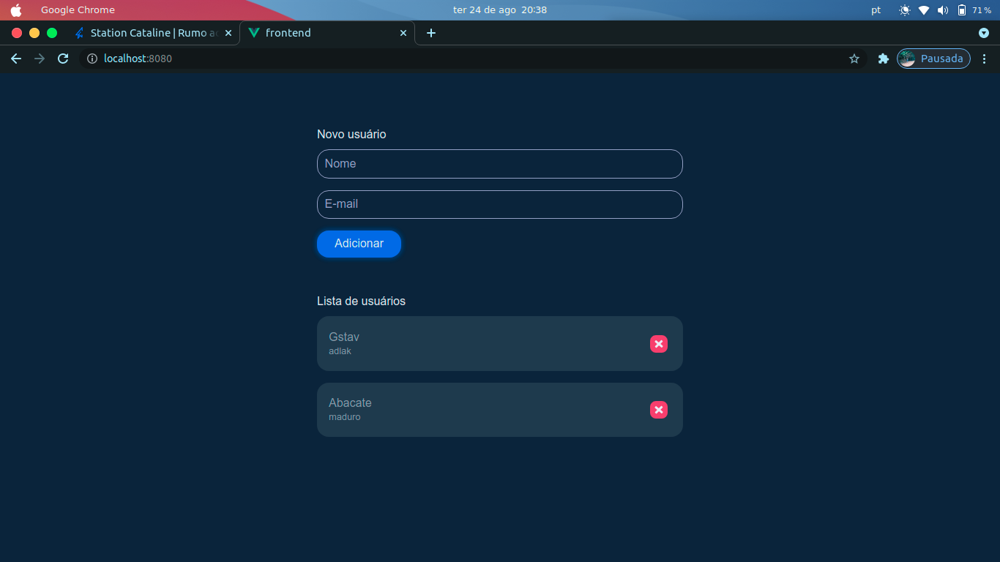

<h1 align="center">Conceitos iniciais com Vue.js</h1>

  

## ✨ Tecnologias

Esse projeto foi desenvolvido com as seguintes tecnologias:

- [Vue](https://vuejs.org/)
- [Typescript](https://www.typescriptlang.org/)

## 💻 Projeto

Um CRUD com Vue usando a API feita em nodeJS anteriormente.

## 🚀 Como executar

- Clone o repositório
- Rode `yarn` para baixar as dependências
- Rode o `yarn dev` para iniciar a aplicação.

Por fim, a aplicação estará disponível em `http://localhost:8080/`.

---
Feito com 💜 &nbsp;no bootcamp da Cataline 👋🏻 &nbsp;